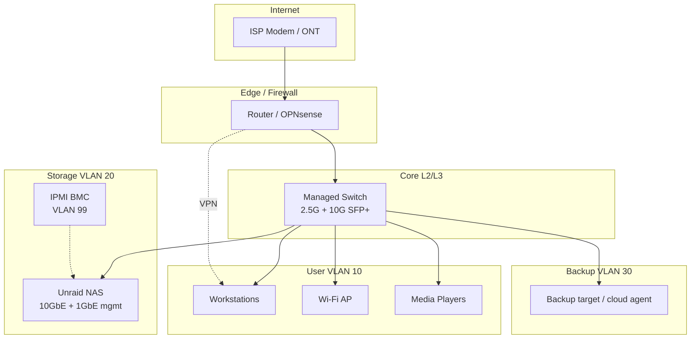
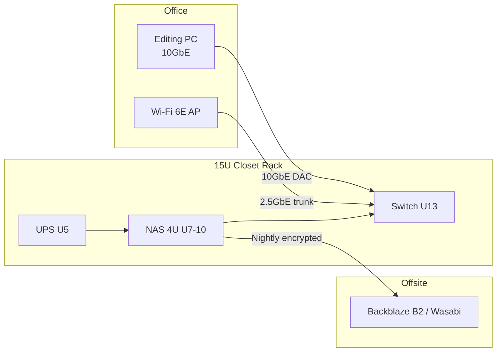
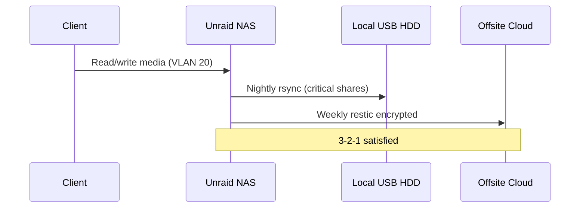

# Network and infrastructure layout

## Design principles

1. **Management** (IPMI, switch admin) separated from **storage traffic**
2. **Clients** reach NAS via dedicated storage VLAN or L2 same-subnet for homelab
3. **Backups** can use isolated VLAN with firewall rules to NAS only
4. **No direct internet exposure** of SMB/NFS — VPN or reverse proxy for remote

---

## High-level topology (mermaid)

---

## Physical layout (mermaid)

---

## VLAN plan (homelab)

| VLAN ID | Name | Subnet example | Members | Purpose |
|---------|------|----------------|---------|---------|
| 10 | LAN | 192.168.10.0/24 | PCs, phones, TVs | General |
| 20 | STORAGE | 192.168.20.0/24 | NAS data NIC, 10GbE clients | SMB/NFS/iSCSI |
| 30 | BACKUP | 192.168.30.0/24 | Backup server, NAS backup NIC optional | Restricted |
| 99 | MGMT | 192.168.99.0/24 | IPMI, switch, AP admin | No internet route |

### Firewall rules (summary)

| From | To | Allow |
|------|-----|-------|
| LAN | STORAGE | 445, 2049, 32400 (Plex) |
| LAN | MGMT | Deny (admin jump host only) |
| STORAGE | Internet | Deny (updates via proxy or LAN) |
| BACKUP | STORAGE | rsync/SSH only to backup share |
| Internet | NAS | **Deny** all inbound |

---

## NIC allocation (recommended build)

| Interface | Speed | VLAN | Role |
|-----------|-------|------|------|
| `eth0` (onboard) | 1 GbE | 99 | Management / Unraid WebGUI |
| `bond0` (X550-T2) | 10 GbE ×2 | 20 | Storage; LACP optional |
| IPMI | 1 GbE | 99 | Out-of-band only |

**Homelab simplification:** single 10GbE to switch + 1GbE management on separate subnet without bonding.

---

## Switch port map (example 24-port)

| Ports | Device | Speed |
|-------|--------|-------|
| 1–2 | NAS (LAG) | 10G SFP+ |
| 3 | Workstation | 10G SFP+ |
| 4–8 | 2.5G access | 2.5GBase-T |
| 9–16 | General LAN | 1G |
| 17 | Uplink to router | 10G or 2.5G |
| 18–24 | Spare / AP / IoT | mixed |

---

## Where NAS sits vs backups

| Role | System | Notes |
|------|--------|-------|
| Primary copy | Unraid array | Live |
| Secondary | USB or 2nd NAS | Same site, different device |
| Tertiary | B2/Wasabi | Encrypted; lifecycle rules |

---

## Remote access

| Method | Use |
|--------|-----|
| WireGuard on router | Remote admin + SMB over VPN |
| Tailscale on NAS | Easy homelab; mind ACLs |
| Cloudflare Tunnel | Web apps only (Notifiarr, etc.) |
| Port-forward SMB | **Avoid** |

---

## DNS and naming

| Host | Example |
|------|---------|
| NAS | `nas.storage.home.arpa` |
| IPMI | `nas-ipmi.mgmt.home.arpa` |
| Static DHCP | Reserve MAC on router or run DHCP on OPNsense |

---

## Cabling checklist

- [ ] Cat6a for 10GBase-T runs < 30 m
- [ ] DAC for rack switch ↔ NAS (< 3 m)
- [ ] Fiber only if electrical isolation needed
- [ ] Separate patch panel label per VLAN color
