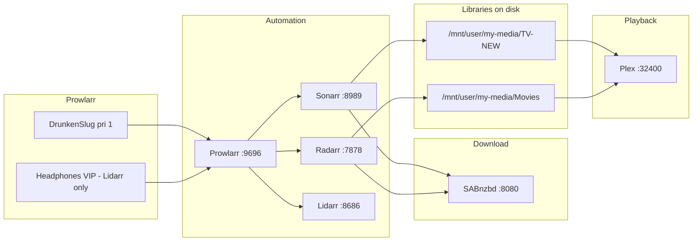

# Media automation stack (Sonarr / Radarr / Prowlarr / Plex)

Operational reference for the **HarryPotter** tower media pipeline as configured 2026-05-24.

## Architecture

## Canonical paths (post-consolidation)

| Purpose | Host path | Sonarr/Radarr mount | Plex mount |
|---------|-----------|---------------------|------------|
| TV library | `/mnt/user/my-media/TV-NEW` | `/tv` | `/tv-shows-2` |
| Movies | `/mnt/user/my-media/Movies` | `/movies` | `/movies-old` |
| Completed downloads (shared) | `/mnt/user/my-downloads/completed` | `/downloads` | — |
| TV category inside container | — | `/downloads/tv` | SAB category `tv` |
| Movie category inside container | — | `/downloads/film` | SAB category `movies` |
| Music (Lidarr) | `/mnt/user/my-media/Music` | `/music` | `/music` |

**Legacy folders** (no longer scanned by Plex; content merging into canonical paths):

| Folder | Size | Status |
|--------|------|--------|
| `/mnt/user/my-media/TV-OLD` | ~106 GB | rsync → `TV-NEW` |
| `/mnt/user/my-media/Movies-new` | ~10 GB | merged → `Movies` |
| `/mnt/user/my-media/TV` | ~6.3 TB | rsync unique titles → `TV-NEW` (background, `--ignore-existing`) |

## Quality profiles (TOPEXX)

Both Sonarr and Radarr use custom **TOPEXX** profiles with TRaSH-style custom format scoring.

### Sonarr (TV)

| Setting | Value |
|---------|-------|
| Cutoff | WEB 1080p group |
| Upgrades | Enabled |
| Allowed | WEB 1080p, Bluray 720p/1080p, Remux 1080p |

| Custom format | Score |
|---------------|-------|
| WEB-DL Preferred | +100 |
| Repack/Proper | +50 |
| x265/HEVC | +25 |
| English Audio | +10 |
| Avoid HDTV | -100 |
| Avoid BR-DISK | -10000 |

### Radarr (Movies)

| Setting | Value |
|---------|-------|
| Cutoff | WEB 2160p group |
| Upgrades | Enabled |
| Allowed | WEB 2160p, Bluray 2160p, Remux 2160p |

| Custom format | Score |
|---------------|-------|
| WEB-DL Preferred | +100 |
| x265/HEVC | +50 |
| Repack/Proper | +50 |
| HDR | +25 |
| English Audio | +10 |
| Avoid BR-DISK | -10000 |

## Naming (Plex-friendly)

**Sonarr**

- Series folder: `{Series Title}`
- Season folder: `Season {season:02}`
- Episode file: `{Series Title} - S{season:00}E{episode:00} - {Episode Title}`

**Radarr**

- Folder & file: `{Movie Title} ({Release Year})`
- Renaming: enabled

## Indexers (Prowlarr-managed)

| Indexer | Priority | Apps |
|---------|----------|------|
| DrunkenSlug | 1 | Sonarr, Radarr (via Prowlarr sync) |
| Headphones VIP | 25 | Lidarr only |

**Note:** nzbplanet.net API key is **invalid** — removed from Sonarr/Radarr. Renew subscription and re-add in Prowlarr as priority 5 backup when credentials work.

## Download client (SABnzbd)

| Category | SAB folder | *arr* sees (same path) |
|----------|------------|------------------------|
| `tv` | `/downloads/tv` | `/downloads/tv` (Sonarr) |
| `movies` | `/downloads/film` | `/downloads/film` (Radarr) |

Sonarr and Radarr both mount the **parent** `completed/` folder so paths match SABnzbd. No remote path mapping required.

Settings: direct unpack on, hardlinks enabled in *arr*, completed download removal on, retention 4500 days in *arr*.

## Release profiles

Both Sonarr and Radarr ignore releases containing: `German`, `FRENCH`, `MULTi`, `SUBFRENCH`, `DUBBED`, `NORDiC`, and similar foreign-language markers. Radarr also blocks `CAM`, `TS`, `TC`.

## Plex libraries

| Library | Path(s) in Plex |
|---------|-----------------|
| Movies | `/movies-old` only |
| TV Shows | `/tv-shows-2` only |
| Music | `/music` |

Partial scan on filesystem changes is enabled.

## Docker templates updated

- **Sonarr:** removed legacy `/TV` (`tv-shows-2`) mount — single library path only.
- **Plex:** removed `TV-OLD` and `Movies-new` template mounts (backups saved as `*.bak.20260523` on flash).

Recreate Plex container from template when convenient to drop unused host binds (optional; Plex DB already consolidated).

## Follow-up actions

1. **Monitor background rsync** — `tail -f /tmp/rsync-tv-legacy.log` on tower until legacy `TV` merge completes.
2. **Renew nzbplanet.net** — add to Prowlarr as backup indexer after API key refresh.
3. **Bazarr** — not yet installed; add for subtitle automation (connect to Sonarr/Radarr, same library paths).
4. **Orphan folders in Sonarr root:** `See`, `The Walking Dead` exist on disk but are not in Sonarr — add manually if still wanted.
5. **Unraid UI:** open Docker → Sonarr → confirm template matches single-TV-mount config after flash edit.

## Decision log entry

| Date | Decision | Rationale |
|------|----------|-----------|
| 2026-05-24 | Prowlarr as sole indexer source for Sonarr/Radarr | Central management, avoid duplicate RSS |
| 2026-05-24 | Canonical libraries: `TV-NEW` + `Movies` | Align *arr*, Plex, and playback paths |
| 2026-05-24 | TOPEXX + custom formats | WEB-first TV 1080p, WEB-first movies 2160p |
| 2026-05-24 | Remove invalid nzbplanet indexer | API test failed — prevents failed search noise |
