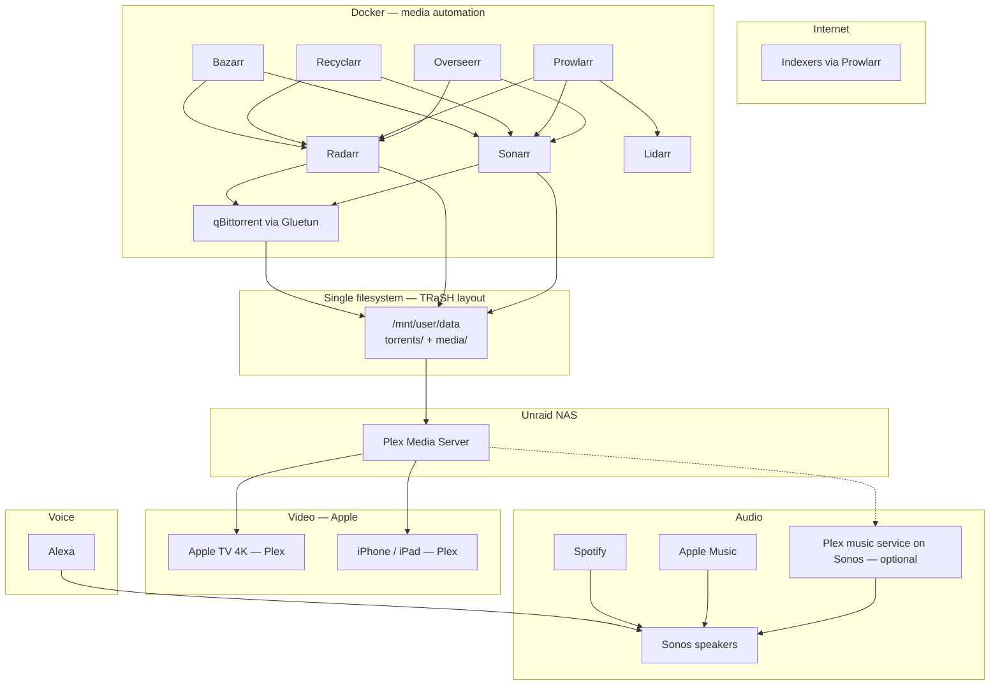

# Media centre strategy

Planning document for the **whole-home media stack**: Plex (playback), *arr* automation (acquisition), Sonos (whole-home audio), and Apple TV / iOS clients. This complements [01-requirements.md](01-requirements.md), [05-network-and-layout.md](05-network-and-layout.md), [06-software-and-ops.md](06-software-and-ops.md), and [07-implementation-phases.md](07-implementation-phases.md).

**Operational tasks, tower audit, and execution status:** [10-plex-arr-workstream.md](10-plex-arr-workstream.md) — use the **“Plex & *arr’s”** Cursor session for all implementation work.

**Last updated:** 2026-05-23

---

## Executive summary

| Area | Decision |
|------|----------|
| Media server | **Plex** (lifetime Plex Pass — no Jellyfin trial or migration) |
| Automation | Full *arr* stack with TRaSH-style paths, quality profiles tuned for **speed / new releases** now; revisit **4K / remux** after NAS hardware upgrade |
| Video clients | **Apple TV 4K** + iPhone / iPad (Plex apps) |
| Whole-home audio | **Sonos** (keep); **Apple Music** + **Spotify** for streaming; local library via Plex where useful |
| Music (explore later) | **Plexamp** — on rolling backlog; not in critical path |
| Voice | **Alexa** ↔ Sonos integration — stabilize connectivity (Wi‑Fi, VLAN, Sonos/Alexa linking) |
| Future | Dedicated **home theatre** room later; will connect to same Plex / network design |
| Rebuild tolerance | **Low** — media used all day; prefer **incremental** changes over big-bang cutovers |

---

## Household profile (locked)

| Question | Answer |
|----------|--------|
| TV / mobile ecosystem | All **Apple** (Apple TV 4K, iPhone, iPad) |
| Receivers / soundbars | **Sonos** for now; dedicated HT gear deferred until new home theatre build |
| Remote sharing | **Plex** shared with family; **lifetime Plex Pass** |
| Streaming music services | **Apple Music** + **Spotify** via Sonos |
| Sonos control | **Sonos app** for zones / grouping |
| Plexamp today | **Not used** — evaluate later ([Plexamp evaluation](#plexamp-on-the-backlog)) |
| Content priority (now) | **Fast availability** of new movies/shows on **1080p-class** profiles; avoid waiting for 4K / large Blu-ray rips |
| Content priority (later) | After full array + hardware refresh, re-profile for **4K / larger files** and storage headroom |
| Security | Open to **VPN for download client**, **VLAN segmentation**, **NAT hairpin** fixes — must not materially hurt LAN playback or download throughput |
| Sonos reliability | Generally good; **occasional dropouts** — improve **Alexa ↔ Sonos** and network stability |

---

## Target architecture



**Principles**

1. **Plex** is the only library server for video (and primary for local music metadata).
2. **One request front door:** Overseerr → Sonarr / Radarr (and Lidarr if music automation is enabled).
3. **One data tree** on one Unraid share/filesystem for hardlinks ([TRaSH Guides — Unraid](https://trash-guides.info/File-and-Folder-Structure/How-to-set-up/Unraid/)).
4. **Downloads** exit via VPN container only; Plex and Sonos stay on trusted LAN paths.
5. **No Jellyfin** in scope for this project.

---

## Software stack

### Core (deploy on new or existing Unraid)

| Component | Role | Notes |
|-----------|------|--------|
| **Plex Media Server** | Playback, sharing, HW transcode (Pass) | Apple TV clients; remote access covered by lifetime Pass |
| **Overseerr** | Request UI for household | Connects to Plex + Sonarr + Radarr |
| **Prowlarr** | Indexer hub | Sync indexers to all *arr* apps |
| **Sonarr** | TV automation | Profile: fast web releases ([Quality phase 1](#quality-phase-1-now)) |
| **Radarr** | Movie automation | Same — prioritize release speed over remux |
| **Lidarr** | Music automation | Optional until local music library is a priority |
| **Bazarr** | Subtitles | Sonarr + Radarr |
| **Recyclarr** | Sync TRaSH quality profiles / custom formats | Start with **HD web**-style templates; swap profiles in phase 2 |
| **qBittorrent** (or SABnzbd) | Downloads | Behind **Gluetun** if using VPN |
| **Gluetun** | VPN for downloader only | Do not route Plex through VPN |
| **Tautulli** | Plex stats, streams, alerts | Useful for “who’s transcoding” during busy evenings |

### Optional (later)

| Component | Role |
|-----------|------|
| **Profilarr** | GUI alternative/complement to Recyclarr for profile sync |
| **Tdarr** | Batch remux/transcode after quality phase 2 |
| **Notifiarr / Discord webhooks** | Download + health alerts |

### Explicitly out of scope

| Component | Reason |
|-----------|--------|
| Jellyfin / Emby | Household standard is **Plex** + lifetime Pass |
| Jellyseerr | Use **Overseerr** with Plex |

---

## Storage layout (TRaSH / hardlinks)

Enable **Tunable: support Hard Links** in Unraid → Settings → Global Share Settings.

Recommended share: **`data`** (single share, one filesystem):

```
/mnt/user/data/
├── torrents/
│   ├── movies/
│   ├── tv/
│   └── music/          # if using Lidarr
└── media/
    ├── movies/
    ├── tv/
    └── music/
```

**Container path rule:** Map the same host path into every container, e.g. host `/mnt/user/data` → container `/data`. Sonarr/Radarr/qBittorrent see `/data/torrents/...` and `/data/media/...`; Plex sees `/data/media/...` only.

Avoid split Docker mounts like `/movies` + `/downloads` on different volume roots — that breaks hardlinks and forces slow copy+delete imports.

See also [03-redundancy-and-array.md](03-redundancy-and-array.md) (array vs cache) — active torrents can live on **cache**; mover syncs to array when seeding policy allows.

---

## Quality phase 1 (now)

**Goal:** New theatrical and series episodes available **quickly**, acceptable quality on **4K TVs** via direct play or light transcode, **smaller downloads** to reduce disk churn before the new array.

| Setting | Guidance |
|---------|----------|
| Radarr / Sonarr profiles | TRaSH **WEB-1080p** (or equivalent “HD WEB” profile) — not remux, not wait-for-4K |
| Custom formats | Prefer **WEB-DL / streaming** groups; deprioritize huge remux / Blu-ray-only delays |
| Recyclarr | Sync **one** movie + **one** TV profile first; document `trash_id`s in appdata backup |
| Plex libraries | Separate **Movies** and **TV** roots under `media/` |
| Apple TV | Most WEB-1080p files **direct play**; Pass covers HW transcode when needed |

**After hardware upgrade (phase 2):** Re-run Recyclarr with **4K / remux** (or hybrid “1080p fast + 4K optional”) profiles; expand array capacity planning in [08-cost-summary.md](08-cost-summary.md).

---

## Quality phase 2 (post array / hardware refresh)

Trigger when new Unraid box is stable and capacity targets from [01-requirements.md](01-requirements.md) are met.

- [ ] Re-profile Radarr/Sonarr for **4K WEB** or **remux** where worth the wait
- [ ] Evaluate **Intel Arc** (or sustained Quick Sync load) if concurrent 4K transcodes increase
- [ ] Consider **Tdarr** for problematic codecs on Apple TV
- [ ] Revisit **10GbE** to main Apple TV if large bitrates stutter

---

## Video: Apple + Plex

| Topic | Recommendation |
|-------|----------------|
| Primary client | **Plex** on **Apple TV 4K** (all rooms) |
| Mobile | Plex iOS; same Plex home / shared users |
| Server location | **Unraid** only (not Shield-as-server) |
| Transcoding | **Intel Quick Sync** on E-2388G for phase 1; optional **Arc A380+** later ([02-hardware-bom.md](02-hardware-bom.md)) |
| Audio on ATV | Apple TV often decodes to **LPCM** for some formats — acceptable until dedicated HT; document receiver needs when HT is built |
| Remote | Lifetime Pass — ensure **Remote Access** healthy; prefer **Tailscale** for admin, not exposed Plex ports |

**Apple TV note:** No DTS bitstream on Apple TV — plan HT room later with gear that matches your library (Atmos via AAC/EC-3/Dolby Digital Plus is typical for most WEB rips).

---

## Audio: Sonos + streaming + Plex

### Current workflow (keep)

1. **Apple Music** and **Spotify** as primary music sources → play through **Sonos** (native services or Sonos app).
2. **Sonos app** for grouping, volume, and room control.
3. **Alexa** for voice — maintain reliable Sonos skill / account linking ([Alexa and Sonos stability](#alexa-and-sonos-stability)).

### Plex on Sonos (local library)

Use when you want **your** music files (from NAS) on Sonos without copying the whole library into Sonos indexing.

| Method | Pros | Cons |
|--------|------|------|
| **Plex service in Sonos app** | No Plexamp required; works with free-tier server features for basic library play | Often uses **Plex cloud path**; needs **NAT hairpin** on router; occasional “connection lost” reports |
| **Plexamp → Sonos** | Better discovery (Sonic Analysis, stations); more reliable for some households | Requires **Plex Pass** for full Plexamp; separate app workflow |
| **Sonos local index** | No Plex dependency | Poor fit for very large libraries; playlist limits |

**Network checklist for Plex ↔ Sonos**

- [ ] Enable **NAT reflection / hairpin NAT** on OPNsense/router (Plex docs call this out for Sonos)
- [ ] Plex server **LAN IP static**; custom server access URLs include `http://<nas-ip>:32400`
- [ ] Sonos and NAS on **same client VLAN** (or routed without blocking mDNS/HTTP where needed)
- [ ] Wi‑Fi: Sonos on **stable 5 GHz** or wired Sonos ports where available

### Plexamp on the backlog

**Status:** Explore after *arr* stack is stable — not blocking daily use.

| Use case | Why consider Plexamp |
|----------|----------------------|
| Large local music library on NAS | Better browsing than Sonos Plex integration alone |
| “Radio” / Sonic Analysis stations | Save playlists → play via Sonos Plex service |
| Mobile | Plexamp iOS while driving / away (Pass) |

**Evaluation tasks (when scheduled)**

1. Install Plexamp on one iPhone; point at Unraid Plex.
2. Compare **Plexamp → Sonos** vs **Sonos app → Plex** for dropout rate and playlist access.
3. Decide default household pattern; document in decision log below.

---

## Alexa and Sonos stability

Occasional Sonos dropouts may be **network** or **voice path** related, not Plex.

| Area | Action |
|------|--------|
| Sonos ↔ Wi‑Fi | Reduce mesh hop count; wired backhaul for primary speakers if possible |
| Alexa ↔ Sonos | Re-link Sonos skill; avoid duplicate room names across Alexa and Sonos |
| VLANs | Keep Sonos + Apple TVs + NAS on **client VLAN** with rules documented in [05-network-and-layout.md](05-network-and-layout.md); avoid blocking Sonos cloud control |
| Interference | Separate IoT-heavy VLAN only if Sonos control is proven unaffected |
| Monitoring | Note dropout time / room / source (Spotify vs Plex vs Alexa) in a short log before changing hardware |

---

## Network and security

Align with [05-network-and-layout.md](05-network-and-layout.md).

| Traffic | VLAN / path | Notes |
|---------|-------------|--------|
| Plex → Apple TV | Client VLAN 10 | Port **32400** LAN; no WAN exposure required if using Pass + relay or Tailscale |
| Sonos | Client VLAN 10 | Internet for streaming services; LAN to NAS for Plex if hairpin works |
| qBittorrent | Same NAS; **Gluetun** network namespace | VPN kill-switch; port forward only if required by tracker |
| Admin / Unraid GUI | Mgmt VPN or VLAN 99 | No public WebGUI |
| Remote admin | **Tailscale** or **WireGuard** ([06-software-and-ops.md](06-software-and-ops.md)) | Prefer over Plex port forward for management |

**Firewall (conceptual)**

| From | To | Allow |
|------|-----|--------|
| Clients | NAS:32400 | Plex |
| Sonos | NAS:32400 | Plex (local) |
| NAS (Gluetun) | VPN provider | Encrypted egress only for torrent |
| WAN | NAS | Deny by default |

---

## Hardware alignment

From [02-hardware-bom.md](02-hardware-bom.md) and [01-requirements.md](01-requirements.md):

| Component | Media role |
|-----------|------------|
| **Xeon E-2388G** | Plex HW transcode (Quick Sync); 1–3 evening streams realistic |
| **64 GB ECC** | Docker stack headroom |
| **Mirrored NVMe cache** | `appdata`, active torrents |
| **Array (16 TB CMR)** | `media/` library growth |
| **2.5GbE / 10GbE** | 1080p WEB direct play fine on 1 GbE; 10G optional until 4K remux-heavy |
| **GPU (later)** | Intel Arc if transcode graphs stay pegged after phase 2 quality |

---

## Rollout: incremental (low downtime)

Media runs **all day** — avoid “replace everything Sunday” unless unavoidable.

### Wave A — Non-disruptive prep (current NAS if applicable)

- [ ] Document existing container paths vs TRaSH `data/` layout
- [ ] Enable hard-link tunable; plan folder migration in a low-usage window
- [ ] Deploy **Prowlarr**; migrate indexers from Sonarr/Radarr
- [ ] Deploy **Recyclarr** with **phase 1** profiles only

### Wave B — Request and visibility

- [ ] Deploy **Overseerr**; connect Plex + Sonarr + Radarr
- [ ] Deploy **Tautulli** for stream monitoring
- [ ] Household quick-start: “request in Overseerr, watch in Plex”

### Wave C — Downloader hardening

- [ ] Move qBittorrent behind **Gluetun**; verify port mapping / kill switch
- [ ] **Bazarr** for subtitles

### Wave D — Music (optional)

- [ ] **Lidarr** only if expanding local music on NAS
- [ ] Schedule **Plexamp evaluation** ([backlog](#plexamp-on-the-backlog))

### Wave E — New hardware cutover

- [ ] Migrate `appdata` + `data` share to new Unraid ([07-implementation-phases.md](07-implementation-phases.md) Phase 6–7)
- [ ] Re-point Plex libraries; verify Apple TV libraries refresh
- [ ] Re-test Sonos Plex + Alexa after IP/DNS changes

### Wave F — Quality phase 2

- [ ] Recyclarr profile upgrade; storage review

---

## Future: home theatre room

When the dedicated HT is built:

- [ ] Choose **display + AVR** with explicit codec support (Atmos, DTS:X if ripping remux)
- [ ] Decide HT playback device (**Apple TV 4K** vs **Shield** only if Apple codecs insufficient)
- [ ] Wire **HDMI eARC**; consider **wired Ethernet** for streamer
- [ ] Integrate HT with **Sonos** (Sonos home theatre products or AVR zone) — separate decision doc section can be added then
- [ ] Same **Plex server** on Unraid; no second media library

---

## Success criteria

1. Household can **request** shows/movies in Overseerr and see them in Plex without manual hunts.
2. New releases appear within policy (**WEB-1080p fast**) without manual Radarr/Sonarr babysitting.
3. **Apple TV** direct play ≥80% for current profile (measure via Tautulli).
4. **Sonos** + **Alexa** + **Spotify/Apple Music** remain primary music; Plex music path documented and tested once.
5. Downloads isolated behind **VPN** without breaking LAN Plex performance.
6. Zero requirement to adopt Jellyfin.

---

## Decision log (media centre)

| Date | Decision | Rationale |
|------|----------|-----------|
| 2026-05-23 | **Plex** remains sole media server | Lifetime Plex Pass; all-Apple clients |
| 2026-05-23 | **No Jellyfin** trial | User preference; Pass already covers needs |
| 2026-05-23 | **Sonos** retained for whole-home audio | Works well; HT upgrade later |
| 2026-05-23 | Quality **phase 1 = fast WEB-1080p** | 4K TVs but prioritize release speed until new array |
| 2026-05-23 | Deploy full *arr* + Overseerr + Recyclarr + Bazarr | Automation-first rebuild |
| 2026-05-23 | **Plexamp** deferred to backlog | Apple Music / Spotify + Sonos sufficient today |
| 2026-05-23 | **Incremental rollout** | Near-24/7 media usage |

---

## Related documents

| Doc | Link |
|-----|------|
| **Plex & *arr tasks (tower)** | [10-plex-arr-workstream.md](10-plex-arr-workstream.md) |
| **iOS / Helmarr ops** | [11-ios-media-ops.md](11-ios-media-ops.md) |
| Requirements | [01-requirements.md](01-requirements.md) |
| Hardware BOM | [02-hardware-bom.md](02-hardware-bom.md) |
| Network / VLANs | [05-network-and-layout.md](05-network-and-layout.md) |
| Software baseline | [06-software-and-ops.md](06-software-and-ops.md) |
| Implementation phases | [07-implementation-phases.md](07-implementation-phases.md) |

## External references

- [TRaSH Guides — Unraid folder structure](https://trash-guides.info/File-and-Folder-Structure/How-to-set-up/Unraid/)
- [Recyclarr getting started](https://recyclarr.dev/guide/getting-started/)
- [Plex — remote playback requirements](https://support.plex.tv/articles/requirements-for-remote-playback-of-personal-media/)
- [Plex — Sonos / NAT loopback](https://support.plex.tv/articles/200288887-using-plex-for-sonos/)
