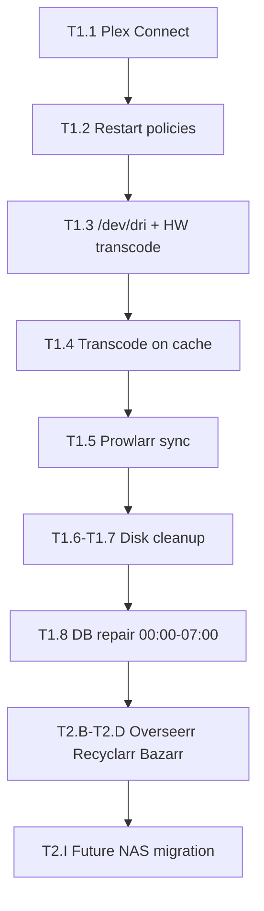

# Plex & *arr workstream (canonical)

**Single source of truth** for the **“Plex & *arr’s”** Cursor session and all Plex/Sonarr/Radarr work on **tower** (current Unraid) and the **future array** (planned build).

Strategy and household decisions: [09-media-centre.md](09-media-centre.md).  
This doc = **live tower state**, **audit findings**, **unified task list**, and **execution rules**.

**Merged from:** media-centre planning chat (2026-05-23) + tower audit chat ([950fdba7-f409-47f5-8123-5f55eae23ab0](950fdba7-f409-47f5-8123-5f55eae23ab0)).

**Last updated:** 2026-05-24 (Overseerr + Tautulli deployed)

---

## Maintenance window policy (tower)

**Timezone:** `Pacific/Auckland` (NZST/NZDT) — always run `date` on tower before scheduling.

### Window

| Period | Allowed |
|--------|---------|
| **00:00–07:00** daily | Maintenance, moves, parity, DB repair, bulk rsync, heavy cleanup |
| **07:00–24:00** | Normal media use; read-only SSH diagnostics only |

This is the **only** window for heavy work — even if the user asks or commits during the day, **defer to the next 00:00–07:00 window** (queue it; do not execute).

### Scheduling rules

1. **One heavy job per night** (parity, Plex DB, multi-TB rsync, large cleanup). Heavy spillover rolls to the **next** 00:00–07:00 window automatically (parity script pauses at 07:00).
2. **Night already has a heavy task** → schedule new heavy work on a **different night**.
3. **Same night stacking** → only **light** tasks (< ~15 min, low array I/O): e.g. Docker restart policy, Plex Connect, indexer fix — alongside an existing heavy job only if total load stays modest.
4. **Agents must not run** `grep -r`, `find /mnt/user`, `lsof +D`, or multi-TB `rsync`/`cp` outside the window (caused CPU meltdown 2026-05-23/24).

**Tower queue file:** `/boot/config/maintenance-queue.txt`  
**Queue helper:** `bash /boot/config/scripts/maintenance-queue.sh status`  
**Cursor rule:** `/Users/topexnative/.cursor/rules/tower-maintenance-window.mdc`

---

## Scheduled maintenance (tower)

**Maintenance window:** **00:00–07:00** local only. Heavy tasks that do not finish in one window **pause at 07:00** and **resume at 00:00** the next night until complete.

### Task calendar (May–Jun 2026)

Parity needs ~**3–4 nights** (~7 h/night × 4 ≈ full check). Plan assumes **May 25 start**; adjust dates if campaign slips.

| Night (00:00 start) | Task | ID | Weight | Notes |
|---------------------|------|-----|--------|--------|
| **Sun→Mon 2026-05-25** | Correcting parity (night 1) | T1.11 | **heavy** | Auto via cron; blocks other heavy work |
| **Mon→Tue 2026-05-26** | Correcting parity (night 2) | T1.11 | **heavy** | Resume if incomplete |
| **Tue→Wed 2026-05-27** | Correcting parity (night 3) | T1.11 | **heavy** | Resume if incomplete |
| **Wed→Thu 2026-05-28** | Correcting parity (night 4 / finish) | T1.11 | **heavy** | Campaign ends on success |
| **Thu→Fri 2026-05-29** | Plex DB repair | T1.8 | **heavy** | Skip/auto-defer if parity still running at 00:00 |
| **Fri→Sat 2026-05-30** | Stale download cleanup (~1.2 TB) | T1.6 | **heavy** | Verify Sonarr/Radarr queues first |
| **Fri→Sat 2026-05-30** | Docker `unless-stopped` | T1.2 | light | Same night OK — quick template edits |
| **Sun→Mon 2026-06-01** | TV consolidation rsync | T3.1 | **heavy** | TV-OLD/TV → TV-NEW; **never daytime** |
| **Mon→Tue 2026-06-02** | my-media clutter / Plex backups | T1.7 | **heavy** | After T1.6 |
| **TBD Jun 2026** | Movie root consolidation | T3.2 | **heavy** | Dedicated night after T3.1 |
| **TBD Jun 2026** | Swap on cache | T1.9 | light | Any free night |

**Weekly (outside core window):** `plex-arr-cleanup-completed.sh` Sundays 04:30 — light orphan scan; OK.

If parity finishes early (e.g. night 3), shift **T1.8** forward to the first free heavy slot.

### Active campaign: correcting parity check

| Item | Value |
|------|--------|
| **First run** | **Monday 2026-05-25 00:00** NZST (Sunday night / Mon early AM) |
| **Window** | 00:00–07:00 daily until successful |
| **Command** | `mdcmd check correct` (write corrections to parity) |
| **Spillover** | ~17–22 h typical for full check on this array; expect **3–4 nights** |
| **Script** | `/boot/config/scripts/parity-correcting-maintenance.sh` |
| **Cron** | `0 0 * * *` `bash …/parity-correcting-maintenance.sh start` · `0 7 * * *` pause (root crontab via `/boot/config/go`) |
| **Log** | `/var/log/parity-correcting-maintenance.log` |
| **Campaign ends** | When `/boot/config/parity-checks.log` shows last run **exit 0, errors 0** → removes `/boot/config/parity-correcting-campaign.active` |

**Verify before Sunday night:**

```bash
ssh tower 'bash /boot/config/scripts/parity-correcting-maintenance.sh status'
ssh tower 'bash /boot/config/scripts/maintenance-queue.sh status'
crontab -l | grep parity-correcting
```

**Cancel campaign:**

```bash
ssh tower 'rm -f /boot/config/parity-correcting-campaign.active'
# If parity is running outside window: Main → Array Operation → Cancel Parity Check
```

**Manual start (only inside 00:00–07:00):**

```bash
ssh tower 'bash /boot/config/scripts/parity-correcting-maintenance.sh start'
```

**UI equivalent:** Main → **Array Operation** → **Parity Check** → check **Write corrections to parity** → Start (then use Cancel/Pause outside window instead of leaving it running all day).

**Do not run** `grep -r`, `find /mnt/user`, or `lsof +D` on `/mnt/user` from agents.

**Separate (not window-bound):** Replace **disk 3** (`sdf`, 16 realloc) and **disk 6** (`sdi`, 40 realloc); improve airflow on **disk 2** (`sdg`, ~48°C).

---

## How to use this in Cursor

1. Continue all Plex / Sonarr / Radarr / Prowlarr / SAB work in the **“Plex & *arr’s”** agent chat.
2. Reference this file: `@docs/10-plex-arr-workstream.md` and `@docs/09-media-centre.md`.
3. Do **not** duplicate planning in a third chat — update task checkboxes here when work completes.
4. Use **tower SSH** MCP tools for live changes — **respect maintenance window policy** above.
5. Follow `/Users/topexnative/.cursor/rules/tower-maintenance-window.mdc` for all tower work.

---

## Household decisions (do not re-litigate)

| Topic | Decision |
|-------|----------|
| Media server | **Plex only** — lifetime Plex Pass; **no Jellyfin** |
| Clients | **Apple TV 4K** + iOS |
| Audio | **Sonos** + Apple Music / Spotify; **Plexamp** = backlog |
| Quality (now) | **Fast WEB-1080p** (Recyclarr/TRaSH phase 1) — not 4K/remux wait |
| Quality (later) | Re-profile after new NAS hardware ([09-media-centre.md](09-media-centre.md) phase 2) |
| Downtime | Media **all day** — **all heavy maintenance 00:00–07:00 only**; defer daytime commits to next window |
| Future NAS paths | TRaSH `data/` layout on new box — **do not force on tower mid-audit** unless planned |

---

## Current tower snapshot (Unraid 7.1.4)

Audit date: **2026-05-23** (live SSH inspection).

### Containers

| Container | Image | Network | Restart policy (audit) |
|-----------|--------|---------|-------------------------|
| Plex-Media-Server | `plexinc/pms-docker` ~1.43.x | **host** | `no` → target **`unless-stopped`** |
| Sonarr | linuxserver 4.0.17 | bridge :8989 | `no` → **`unless-stopped`** |
| Radarr | linuxserver | bridge :7878 | `no` → **`unless-stopped`** |
| Prowlarr | linuxserver | bridge :9696 | `no` → **`unless-stopped`** |
| SABnzbd | linuxserver | bridge :8080 | `no` → **`unless-stopped`** |

| **Overseerr** | `sctx/overseerr` | bridge :5055 | `unless-stopped` | **Wizard pending** — Plex sign-in at `/setup` |
| **Tautulli** | `tautulli/tautulli` | **host** :8181 | `unless-stopped` | **Wizard pending** — host net for Plex :32400; `/welcome` |

**Not running (deploy later):** Bazarr, Recyclarr, Gluetun (tower uses SAB today).

**Note:** `lscr.io` DNS failed on tower 2026-05-24; used Docker Hub images (`sctx/overseerr`, `tautulli/tautulli`) instead of linuxserver templates.

### Paths (today — legacy layout)

| Role | Host (Unraid) | In-container |
|------|---------------|--------------|
| Movies (Radarr + Plex) | `my-media/Movies` (~24 TB) | Radarr `/movies`; Plex `/movies-old` |
| Movies (Plex only) | `my-media/Movies-new` (~10 GB) | Plex `/movies-new` |
| TV (Sonarr + Plex) | `my-media/TV-NEW` (~7.1 TB) | Sonarr `/tv`; Plex `/tv-shows-2` |
| TV (Plex legacy) | `my-media/TV-OLD`, `my-media/TV` | Plex `/tv-shows-1`; Sonarr extra mount legacy |
| Downloads | `my-downloads/completed/tv` (~626 GB), `.../film` (~572 GB) | SAB categories `tv` / `movies` |
| Transcode temp | `my-media/Transcode` (array, cache=no) | Plex `/transcode` |
| Appdata | `appdata/*` on cache pool | — |

**Working:** hardlinks enabled, remote path mappings to tower IP, SAB categories match *arr*, FSEvents + scheduled Plex scans.

**Broken / gap:**

| Issue | Severity |
|-------|----------|
| Plex DB **malformed / index corruption** | Critical — repair **00:00–07:00 only** |
| Array **~90% full** (~4.6 TB free on ~40 TB used) | Critical |
| **~1.2 TB** stale `completed/tv` + `completed/film` | Critical |
| **No Plex Connect** on Sonarr/Radarr import | High |
| **No `/dev/dri`** in Plex container; AMD GPU on host unused | High |
| Transcode on **array** not cache | High |
| Restart policy **no** on all media containers | High |
| Prowlarr only syncs **Lidarr**; **1** indexer; nzbplanet unhealthy | Medium |
| Split TV/movie roots (legacy folders) | Medium (consolidate later) |
| No Bazarr / Recyclarr | Medium (roadmap) |
| Overseerr / Tautulli wizards incomplete | High — blocks Helmarr / iOS requests |

### Host hardware (tower today vs future build)

| | Tower (today) | Future array ([02-hardware-bom.md](02-hardware-bom.md)) |
|--|---------------|-----------------------------------------------------------|
| CPU | Xeon E3-1220 v3 (4C) | Xeon E-2388G (8C, Quick Sync) |
| RAM | 15 GB, no swap | 64 GB ECC |
| GPU | AMD R7 370 / R9 270X | Optional Intel Arc later |
| Transcode | CPU-only in practice | Quick Sync + Pass |

---

## Execution constraints

| Rule | Detail |
|------|--------|
| **Maintenance window** | **00:00–07:00 only** for moves, parity, DB repair, bulk rsync — queue daytime requests |
| **Scheduling** | One **heavy** job per night; new heavy work → different night unless task is **light** |
| **Plex database repair** | **Only 00:00–07:00** — scheduled **2026-05-29** after parity campaign |
| **Plex stop/start** | Avoid outside maintenance window unless emergency |
| **Approved scope** | User approved full audit action plan + “the works” except DB repair timing |
| **Secrets** | Rotate credentials if exposed in templates; do not commit API keys to this repo |

---

## Unified task list

Status key: `todo` | `in_progress` | `done` | `blocked` | `scheduled`

### Track 1 — Tower immediate (audit action plan)

User approved unattended execution in Plex & *arr session. DB repair deferred to maintenance window.

| ID | Task | Status | Notes |
|----|------|--------|-------|
| T1.1 | Add **Plex Connect** in Sonarr + Radarr (`http://127.0.0.1:32400`, On Import) | `in_progress` | Plex uses host network |
| T1.2 | Docker **restart policy** `unless-stopped` — Plex, Sonarr, Radarr, Prowlarr, SAB | `scheduled` | **2026-05-30** light; same night as T1.6 OK |
| T1.3 | Pass **`/dev/dri`** into Plex; enable HW transcode in Plex UI | `todo` | Light — any free night after T1.8 |
| T1.4 | Move **transcode temp** to cache (`/mnt/cache/...`) | `todo` | Light — stack with T1.2 if needed |
| T1.5 | **Prowlarr** — add Sonarr + Radarr apps; fix/remove dead indexers | `todo` | Light — daytime OK (appdata only) |
| T1.6 | **Cleanup** ~1.2 TB `completed/tv` + `completed/film` (safe orphans only) | `scheduled` | **2026-05-30** heavy; verify queues first |
| T1.7 | Free broader disk — audit `my-media` clutter, duplicate Plex backups | `scheduled` | **2026-06-02** heavy |
| T1.8 | **Plex DB repair** — 00:00–07:00 only | `scheduled` | **2026-05-29** heavy; defer if parity active |
| T1.11 | **Correcting parity check** — multi-night campaign | `scheduled` | **2026-05-25–28**; auto cron |
| T1.9 | Optional: **swap** on cache; **pin** Plex image tag after repair | `todo` | Light — TBD Jun 2026 |
| T1.10 | Document changes in this file + decision log | `in_progress` | Maintenance policy + queue added 2026-05-24 |

### Track 2 — Roadmap (09-media-centre waves, tower + future NAS)

| ID | Task | Status | Notes |
|----|------|--------|-------|
| T2.A | Document tower paths vs TRaSH `data/` migration plan | `todo` | Defer physical move until maintenance window |
| T2.B | Deploy **Overseerr** + **Tautulli** | `in_progress` | Containers up; SWAG `my-overseerr` + `my-tautulli`; **complete Plex wizards** → [11-ios-media-ops.md](11-ios-media-ops.md) |
| T2.C | Deploy **Recyclarr** — **WEB-1080p fast** profiles | `todo` | Phase 1 quality |
| T2.D | Deploy **Bazarr** | `todo` | |
| T2.E | **Gluetun** + qBittorrent if moving off SAB-only | `todo` | Optional; SAB works today |
| T2.F | **NAT hairpin** for Plex ↔ Sonos (router) | `todo` | See [09-media-centre.md](09-media-centre.md) |
| T2.G | Alexa ↔ Sonos stability (Wi‑Fi, skill re-link) | `todo` | Log dropout source when possible |
| T2.H | **Plexamp** evaluation | `todo` | Backlog |
| T2.I | New NAS cutover — TRaSH `data/`, migrate libraries | `todo` | [07-implementation-phases.md](07-implementation-phases.md) |
| T2.J | Quality **phase 2** — 4K/remux profiles post-hardware | `todo` | |

### Track 3 — Future / hygiene (lower urgency)

| ID | Task | Status | Notes |
|----|------|--------|-------|
| T3.1 | Consolidate TV roots → single Sonarr + Plex folder | `scheduled` | **2026-06-01** heavy rsync; **never daytime** |
| T3.2 | Consolidate movie roots → single Radarr + Plex folder | `todo` | Dedicated heavy night after T3.1 |
| T3.3 | Remove unused Sonarr mount `/tv-shows-2` → legacy `TV` | `todo` |
| T3.4 | Security: rotate exposed creds; remove stale `my-plex.xml` template | `todo` |
| T3.5 | Home theatre room — AVR/codecs/HDMI (when built) | `todo` |

---

## Suggested execution order (Plex & *arr session)



---

## Plex DB repair runbook (00:00–07:00 only)

1. Confirm local time / timezone on tower.
2. Stop **Plex-Media-Server** container.
3. Copy `appdata/Plex-Media-Server/.../Databases/` to dated backup (existing Dec 2024 snapshots + new copy).
4. Start Plex; run **Settings → Troubleshooting → Optimize database** (or restore from last good backup if repair fails).
5. Off-hours: **Analyze** Movies + TV libraries.
6. Verify logs clean; re-enable household use after 07:00.
7. Mark **T1.8** `done` in this file.

---

## Sonarr / Radarr integration checklist (tower)

| Item | Audit | Target |
|------|-------|--------|
| Hardlinks | OK | Keep |
| Remote paths | OK | Keep |
| SAB categories | OK | Keep |
| Plex on import | **Missing** | **T1.1** |
| Completed folder bloat | ~1.2 TB | **T1.6** |
| Indexer health | nzbplanet down | **T1.5** |
| Quality profiles | Legacy | **T2.C** Recyclarr WEB-1080p |

---

## Decision log (workstream)

| Date | Decision | Rationale |
|------|----------|-----------|
| 2026-05-23 | Canonical doc = **10-plex-arr-workstream.md** | Merge media-centre + audit chats |
| 2026-05-23 | Execute audit plan on tower; DB repair **00:00–07:00** | User approval; Plex in use all day |
| 2026-05-23 | Keep legacy `my-media` / `my-downloads` on tower for now | TRaSH `data/` on new NAS, not big-bang |
| 2026-05-23 | Plex-only; WEB-1080p phase 1 | See [09-media-centre.md](09-media-centre.md) |
| 2026-05-23 | Correcting parity campaign via cron + pause/resume 00:00–07:00 | Post-reboot; May 15 check had 6 errors |
| 2026-05-24 | **Maintenance window policy** — all heavy work 00:00–07:00 only; queue + calendar | Daytime rsync caused CPU spike; agents defer commits |
| 2026-05-24 | **Overseerr + Tautulli** deployed (Docker Hub images; Tautulli host network) | iOS Helmarr prep; Plex OAuth wizards remain for user |

---

## Related documents

| Doc | Purpose |
|-----|---------|
| [09-media-centre.md](09-media-centre.md) | Strategy, Sonos, Apple, rollout waves |
| [11-ios-media-ops.md](11-ios-media-ops.md) | iOS apps, Helmarr, notifications, setup wizards |
| [06-software-and-ops.md](06-software-and-ops.md) | Unraid baseline containers |
| [07-implementation-phases.md](07-implementation-phases.md) | New hardware migration |
| [05-network-and-layout.md](05-network-and-layout.md) | VLANs, port 32400 |
