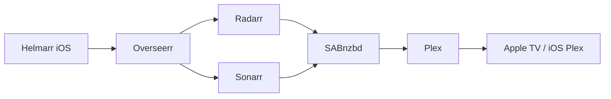

# iOS media ops — Plex alerts, requests, and Helmarr

Companion guide for **iPhone / iPad** administration of the tower Plex and *arr* stack. Strategy context: [09-media-centre.md](09-media-centre.md). Live tower state: [10-plex-arr-workstream.md](10-plex-arr-workstream.md).

**Last updated:** 2026-05-25

**Tower status:** Overseerr and Tautulli containers deployed 2026-05-24. **One-time Plex sign-in** required in each web wizard before Helmarr can connect (see [First-time setup](#first-time-setup-tower)).

---

## What you wanted (and what actually exists)


| Goal                                                       | Best approach                                                                      | Native App Store app                                                                                                                                       |
| ---------------------------------------------------------- | ---------------------------------------------------------------------------------- | ---------------------------------------------------------------------------------------------------------------------------------------------------------- |
| Push alert when a **remote / shared** user starts watching | **Tautulli** playback notifications → **Tautulli Remote** or **official Plex app** | [Tautulli Remote](https://apps.apple.com/us/app/tautulli-remote/id1570909086), [Plex](https://apps.apple.com/us/app/plex-watch-live-tv-movies/id383457673) |
| See **who** is streaming (username, player, quality)       | **Tautulli** activity + **Helmarr** Tautulli tab                                   | Helmarr, Tautulli Remote                                                                                                                                   |
| Find user **email / login**                                | **Tautulli → Users** or Plex Web **Manage Library Access**                         | Tautulli Remote (user list); Plex app does not show emails                                                                                                 |
| **Request** movies & TV (Overseerr → Radarr/Sonarr)        | **Overseerr** + Helmarr **Seerr** integration                                      | [Helmarr](https://apps.apple.com/us/app/helmarr/id1638624921)                                                                                              |
| **Add / manage music** (Lidarr)                            | Helmarr **Lidarr** tab (Overseerr is movies/TV only)                               | Helmarr                                                                                                                                                    |
| Live server dashboard while app is open                    | Plex Dash (no push)                                                                | [Plex Dash](https://apps.apple.com/us/app/plex-dash/id1500797677)                                                                                          |


**No single App Store app does all of the above.** Recommended combo: **Helmarr** (requests + *arr* + Tautulli view) + **Tautulli Remote** or **Plex app** (playback push alerts).

**Plex Dash does not send iOS push notifications** — it is a monitoring dashboard only.

---

## Tower endpoints (HarryPotter / `192.168.1.7`)


| Service       | LAN URL                    | Remote URL (SWAG)                   | Auth on remote |
| ------------- | -------------------------- | ----------------------------------- | -------------- |
| **Overseerr** | `http://192.168.1.7:5055`  | `https://overseerr.gillespie.kiwi`  | Plex login     |
| **Tautulli**  | `http://192.168.1.7:8181`  | `https://tautulli.gillespie.kiwi`   | API key        |
| **Sonarr**    | `http://192.168.1.7:8989`  | `https://sonarr.gillespie.kiwi`     | API key only   |
| **Radarr**    | `http://192.168.1.7:7878`  | `https://radarr.gillespie.kiwi`     | API key only   |
| **Lidarr**    | `http://192.168.1.7:8686`  | `https://lidarr.gillespie.kiwi`     | API key only   |
| **Prowlarr**  | `http://192.168.1.7:9696`  | `https://prowlarr.gillespie.kiwi`   | API key only   |
| **SABnzbd**   | `http://192.168.1.7:8080`  | `https://sabnzbd.gillespie.kiwi`    | API key only   |
| **Plex**      | `http://192.168.1.7:32400` | via Plex relay / Pass               | Plex account   |

Remote URLs require **per-hostname proxied CNAMEs** to the Cloudflare tunnel (wildcard `*.gillespie.kiwi` → `192.168.1.7` is **LAN-only**). SWAG routes by Host header. **Helmarr has no HTTP basic-auth fields** — *arr* / SAB APIs are protected by **API key only** on `/api` paths. Browser access to the web UI (`/`) may still prompt for SWAG login (`helmarr` user in `/boot/config/swag-helmarr-auth.txt`); Helmarr does not need that password.

---

## User emails and logins (Managed Library Access)

Two different Plex user types appear under **Settings → Manage Library Access**:


| Type                                        | Email?                   | Login identity                                                     |
| ------------------------------------------- | ------------------------ | ------------------------------------------------------------------ |
| **Invited Plex accounts** (family/friends)  | Yes — Plex account email | Username shown in Manage Library Access; email used at invite time |
| **Managed accounts** (Plex Home, e.g. kids) | **No email** (by design) | Friendly name only; sign-in via Home admin switch                  |


**Where to look**

1. **Tautulli → Users** — username, email (for real Plex accounts), last seen, IP, devices.
2. **Plex Web** → Settings → Manage Library Access — click each row under *Accounts with Library Access*.
3. **Plex Web** → Settings → Plex Home — managed sub-accounts (no email).

---

## iOS push notifications for remote viewers

### Tier 1 — Official Plex app (zero extra server work)

You have **lifetime Plex Pass** — this works today.

1. **Server:** Settings → Server → General → enable **Push Notifications**.
2. **iPhone Plex app:** Settings → Notifications → **Personal Media → Playback Started**.
3. Enable your server; select which **shared users** trigger alerts.

Alerts fire when playback **starts**, not on every remote connection. Shows **username**, not email.

Docs: [Plex Push Notifications](https://support.plex.tv/articles/push-notifications/)

### Tier 2 — Tautulli + Tautulli Remote (richer filters)

Use when you want **remote-only**, per-user, or stop/watched triggers.

**On tower (Tautulli web UI)**

1. Settings → Notification Agents → add **Tautulli Remote App** (iOS) or **Plex Android / iOS App**.
2. Enable triggers, e.g. **Playback Start**; add conditions: `{stream_location} is wan` for remote-only.
3. For Plex-app agent: match Plex app notification toggles to Tautulli triggers ([Tautulli notification guide](https://docs.tautulli.com/using-tautulli/notification-agents-guide)).

**On iPhone ([Tautulli Remote](https://apps.apple.com/us/app/tautulli-remote/id1570909086))**

1. Settings → consent to OneSignal privacy → wait for registration.
2. Scan QR from Tautulli → Settings → Tautulli Remote App → Register device.
3. Add **secondary connection** URL: `https://tautulli.gillespie.kiwi` for away-from-home.

**Pi-hole / DNS:** whitelist `api.onesignal.com` if iOS notifications silently fail.

---

## Helmarr setup (primary iOS control surface)

[Helmarr](https://apps.apple.com/us/app/helmarr/id1638624921) — native iOS/iPadOS/macOS; connects directly to your self-hosted services (no cloud account).

### Services to add


| Helmarr service       | Tower LAN base URL        | Remote fallback URL                | API key source                      |
| --------------------- | ------------------------- | ---------------------------------- | ----------------------------------- |
| **Seerr** (Overseerr) | `http://192.168.1.7:5055` | `https://overseerr.gillespie.kiwi` | Overseerr → Settings → General      |
| **Tautulli**          | `http://192.168.1.7:8181` | `https://tautulli.gillespie.kiwi`  | Tautulli → Settings → Web Interface |
| **Sonarr**            | `http://192.168.1.7:8989` | `https://sonarr.gillespie.kiwi`     | Sonarr → Settings → General |
| **Radarr**            | `http://192.168.1.7:7878` | `https://radarr.gillespie.kiwi`     | Radarr → Settings → General |
| **Lidarr**            | `http://192.168.1.7:8686` | `https://lidarr.gillespie.kiwi`     | Lidarr → Settings → General |
| **Prowlarr**          | `http://192.168.1.7:9696` | `https://prowlarr.gillespie.kiwi`   | Prowlarr → Settings → General |
| **SABnzbd**           | `http://192.168.1.7:8080` | `https://sabnzbd.gillespie.kiwi`    | SAB → Config → General |


Enable **Smart Connectivity** (LAN primary, WAN fallback) on **every** service. Enter **API key only** — no HTTP username/password in Helmarr. Away from home, the primary LAN URL will fail (expected); fallback HTTPS must work.

**Helmarr per service (example Sonarr):**

| Field | Value |
|-------|--------|
| Primary URL | `http://192.168.1.7:8989` |
| Fallback URL | `https://sonarr.gillespie.kiwi` |
| API key | From Sonarr → Settings → General |
| Smart Connectivity | On |

Probe path is `/api/v3/system/status` — Helmarr sends your API key; SWAG does not require basic auth on `/api`.

### What Helmarr push notifications cover

Helmarr alerts are primarily ***arr* pipeline** events (grabs, imports, health) — not Plex playback by default. For **“who started watching remotely”**, keep **Tautulli Remote** or **Plex app Playback Started** enabled alongside Helmarr.

### Request workflow (household)




1. Browse or search in Helmarr → Seerr.
2. Submit movie / TV request (auto-approve if configured for your account).
3. Radarr/Sonarr grab via Prowlarr → SAB completes → Plex library scan.
4. Watch in Plex on Apple TV or iPhone.

**Music:** use Helmarr → **Lidarr** directly; Overseerr does not handle music requests.

---

## First-time setup (tower)

Containers are running; complete these wizards once (≈5 min each), then configure Helmarr.

### Overseerr

1. Open [http://192.168.1.7:5055/setup](http://192.168.1.7:5055/setup) (or [https://overseerr.gillespie.kiwi/setup](https://overseerr.gillespie.kiwi/setup)).
2. **Sign in with Plex** (admin account).
3. Select **HarryPotter**; sync libraries (Movies, TV Shows — skip Music if not requesting via Overseerr).
4. Add **Sonarr** — hostname `192.168.1.7`, port `8989`, API key from Sonarr → Settings → General, default root folder `/tv`.
5. Add **Radarr** — hostname `192.168.1.7`, port `7878`, API key from Radarr → Settings → General, default root folder `/movies`.
6. Settings → General → copy **API key** into Helmarr **Seerr** service.
7. Optional: auto-approve requests for admin / trusted users.

### Tautulli

1. Open [http://192.168.1.7:8181/welcome](http://192.168.1.7:8181/welcome) (or [https://tautulli.gillespie.kiwi/welcome](https://tautulli.gillespie.kiwi/welcome)).
2. Wizard: set admin HTTP username/password (recommended) → **Sign in with Plex** → select **HarryPotter** (use `127.0.0.1` or `192.168.1.7`, port `32400`, no SSL — Tautulli uses **host network** so it can reach Plex).
3. Finish wizard; Settings → Web Interface → copy **API key** for Helmarr.
4. Configure notification agents (see [iOS push notifications](#tier-2--tautulli--tautulli-remote-richer-filters) above).

### Helmarr (after wizards)

1. Install [Helmarr](https://apps.apple.com/us/app/helmarr/id1638624921).
2. Add **Seerr** — LAN `http://192.168.1.7:5055`, remote `https://overseerr.gillespie.kiwi`, Overseerr API key.
3. Add **Tautulli** — LAN `http://192.168.1.7:8181`, remote `https://tautulli.gillespie.kiwi`, Tautulli API key.
4. Add Sonarr / Radarr / Lidarr / Prowlarr / SABnzbd (see table above).
5. Enable **Smart Connectivity** on Seerr and Tautulli entries.

---

## Alternative iOS apps (narrower scope)


| App                                                                                   | Use case                                   |
| ------------------------------------------------------------------------------------- | ------------------------------------------ |
| [Pocket for Seerr](https://apps.apple.com/us/app/pocket-for-seerr/id6746105104)       | Requests only (Overseerr/Seerr)            |
| [Ovue for Seerr](https://apps.apple.com/us/app/ovue-for-seerr/id6581485306)           | Requests only                              |
| [YaArr](https://apps.apple.com/us/app/yaarr/id6759206399)                             | Helmarr-like *arr* stack alternative       |
| [Remote for Tautulli](https://apps.apple.com/us/app/remote-for-tautulli/id1343177312) | Third-party Tautulli client (not official) |
| [Plex Dash](https://apps.apple.com/us/app/plex-dash/id1500797677)                     | Live dashboard; **no push**                |


---

## Remote access troubleshooting (Helmarr on 4G)

| Symptom | Cause | Fix |
|---------|--------|-----|
| Primary probe fails on 4G | `192.168.1.7` is LAN-only | **Expected** — rely on fallback URL |
| Fallback times out ~10s | Hostname uses wildcard A → `192.168.1.7` (private IP) | Add tunnel route + proxied CNAME (see checklist) |
| Fallback **502** (Sonarr) | Tunnel origin `https://192.168.1.7:443` without **No TLS Verify** | Enable **No TLS Verify** on origin (SWAG cert has no IP SAN) |
| Fallback 401 | SWAG basic auth on `/api` | Fixed — API paths use **API key only** |

### Cloudflare tunnel checklist (`marshal-home`)

Tower runs **`cloudflared`** token-only (no local config file). Tunnel ID: `f7333fc4-04bc-447c-9040-ce0a6a1ba711`. All *arr* remote traffic must go **SWAG** → upstream `192.168.1.7:<port>`; cloudflared only needs to reach SWAG on **443**.

**Verified 2026-05-25**

| Check | Status |
|-------|--------|
| SWAG `my-sonarr.subdomain.conf` upstream `192.168.1.7:8989`, `/api` without basic auth | OK |
| Local SWAG API probes (`curl -H Host: … https://127.0.0.1/api/…`) | **200** all *arr* + Overseerr + Tautulli + SAB |
| `sonarr.gillespie.kiwi` DNS | CNAME → `{tunnel-id}.cfargotunnel.com`, **proxied** |
| Other `*.gillespie.kiwi` *arr* hostnames | Wildcard A `*.gillespie.kiwi` → `192.168.1.7` (**LAN-only**, grey cloud) — **not reachable on 4G** |
| Tunnel public hostname `sonarr.gillespie.kiwi` | Path **empty** (not `^/blog`); service `https://192.168.1.7:443` — **missing No TLS Verify** → **502** |
| Tunnel routes for radarr / lidarr / prowlarr / sabnzbd / overseerr / tautulli | **Not configured** |

**Fix in Cloudflare dashboard** (Zero Trust → Networks → Tunnels → **marshal-home** → Public Hostname):

For **each** hostname below, add or edit a public hostname:

| Public hostname | Path | Service URL | Additional settings |
|-----------------|------|-------------|---------------------|
| `sonarr.gillespie.kiwi` | *(leave empty)* | `https://192.168.1.7:443` | **No TLS Verify: ON** |
| `radarr.gillespie.kiwi` | *(empty)* | `https://192.168.1.7:443` | **No TLS Verify: ON** |
| `lidarr.gillespie.kiwi` | *(empty)* | `https://192.168.1.7:443` | **No TLS Verify: ON** |
| `prowlarr.gillespie.kiwi` | *(empty)* | `https://192.168.1.7:443` | **No TLS Verify: ON** |
| `sabnzbd.gillespie.kiwi` | *(empty)* | `https://192.168.1.7:443` | **No TLS Verify: ON** |
| `overseerr.gillespie.kiwi` | *(empty)* | `https://192.168.1.7:443` | **No TLS Verify: ON** |
| `tautulli.gillespie.kiwi` | *(empty)* | `https://192.168.1.7:443` | **No TLS Verify: ON** |

SWAG selects the correct backend from the **Host** header (`sonarr.*`, `radarr.*`, etc.). Do **not** point the tunnel at container ports (`8989`, `7878`, …) directly.

**DNS** (Cloudflare → **gillespie.kiwi** → DNS): for each hostname above, create a **proxied** CNAME to `f7333fc4-04bc-447c-9040-ce0a6a1ba711.cfargotunnel.com` (same pattern as existing `sonarr`). Explicit records override the wildcard `*.gillespie.kiwi` A → `192.168.1.7`.

**Verify after save** (from phone on 4G or external curl):

```bash
curl -s -o /dev/null -w '%{http_code}\n' 'https://sonarr.gillespie.kiwi/api/v3/system/status?apikey=YOUR_KEY'
```

Expect **200**. **502** = fix No TLS Verify; **timeout** = missing CNAME or tunnel route.

**Note:** `http://192.168.1.7:80` is not a viable tunnel origin — SWAG returns **301** to HTTPS on port 80.

## Security notes

- Remote *arr* APIs are exposed via HTTPS; protect with **strong API keys** and optional SWAG basic auth on the **web UI only** (`/`). Do not publish API keys.
- Store API keys only in Helmarr (on-device) and tower appdata — never commit to this repo.
- Overseerr and Tautulli SWAG vhosts are public HTTPS; consider Authelia/basic auth if URLs are internet-facing.

---

## Related documents


| Doc                       | Link                                                   |
| ------------------------- | ------------------------------------------------------ |
| Media centre strategy     | [09-media-centre.md](09-media-centre.md)               |
| Tower tasks & maintenance | [10-plex-arr-workstream.md](10-plex-arr-workstream.md) |
| Live Sonarr/Radarr paths  | [09-media-automation.md](09-media-automation.md)       |


